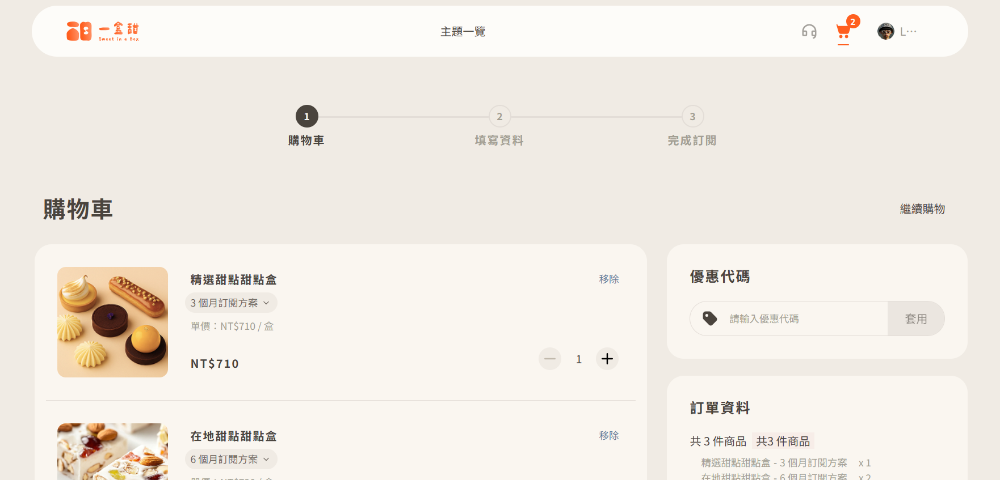
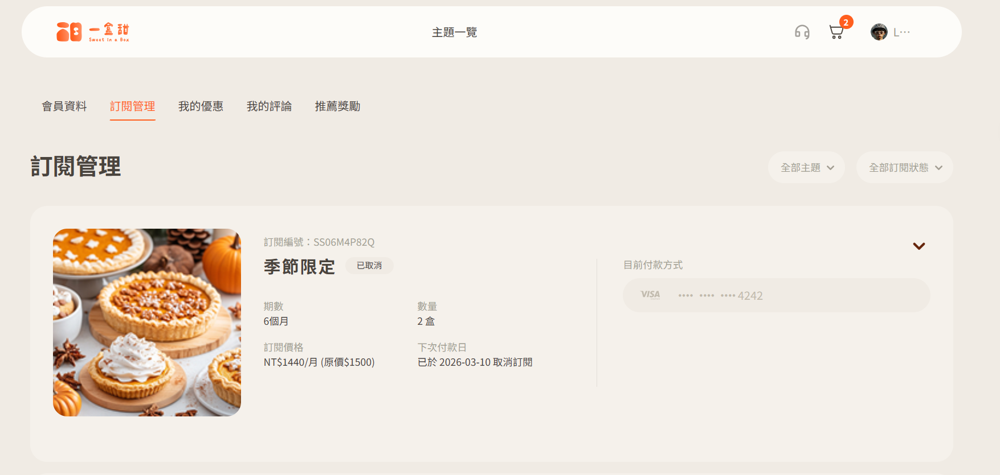
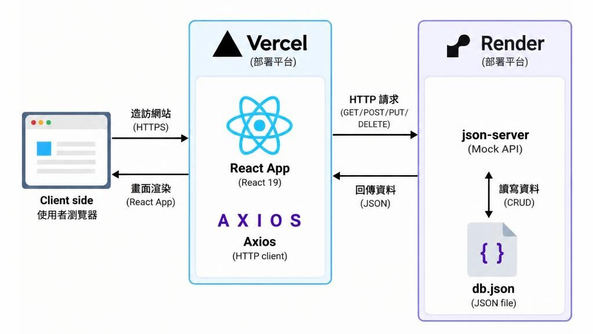

# SweetBox 🍰

訂閱制甜點驚喜盒電商網站，為具有選擇障礙、喜歡嚐鮮又不想踩雷的甜點愛好者，提供固定且充滿驚喜的甜點訂閱體驗。

每月依照訂閱主題寄送季節限定、精選人氣甜點或台灣在地特色點心等主題，讓使用者能輕鬆探索不同甜點。

本專案前期由團隊共同開發，後期由 Chris 負責後續維護與優化，包含技術債處理、功能修復、路由與元件調整，以及部署相關工作。

## 🔗 Demo

- **線上網址：** [SweetBox Demo](https://sweetbox-demo.vercel.app/)
- **一般會員測試帳號 / 密碼：** `lucas@example.com` / `12345678`

> 以上帳號僅供展示使用。

## 📸 畫面預覽

### 首頁


### 主題詳細頁


### 購物車



### 會員訂閱管理



## 🛠 技術棧

| 分類     | 技術                          |
| -------- | ----------------------------- |
| 前端框架 | React 19、Vite                |
| 路由     | React Router                  |
| 狀態管理 | Context API、useReducer       |
| UI／樣式 | Bootstrap 5、SCSS、Ant Design |
| 表單處理 | React Hook Form               |
| API 溝通 | Axios                         |
| Mock API | json-server                   |
| 部署     | Vercel、Render                |

## 🏗 系統架構



## ✨ 功能特色

- **主題瀏覽與詳細頁**：主題列表、方案選擇、甜點內容介紹、使用者評論與分頁
- **購物車與結帳流程**：訂閱方案加入購物車、金額計算、折扣分攤、收件資料與發票資訊填寫，以及付款方式選擇
- **會員系統**：登入、註冊會員
- **訂閱管理**：查看訂閱方案、付款方式、付款紀錄與取消訂閱

## ⚠️ 已知限制

- 後台管理功能尚在開發中，目前僅展示前台與會員功能，不提供後台測試帳號。
- 金流為模擬流程：僅保存卡片品牌、末四碼與效期，不會儲存完整卡號；付款結果為模擬成功，並非真實金流串接。
- 本專案使用 json-server 作為 Mock API，密碼目前以明文儲存，僅供展示用途。

## 💻 本機安裝與執行

### 需求環境

- Node.js `22.x`

### 1. 下載並安裝套件

```bash
git clone https://github.com/yuan6636/sweetbox-react-personal.git
cd sweetbox-react-personal
npm install
```

### 2. 設定環境變數

在專案根目錄建立 `.env` 檔案：

```env
VITE_API_BASE_URL=http://localhost:3000
```

### 3. 啟動 Mock API

```bash
npm run server
```

預設會在 `http://localhost:3000` 啟動 json-server，資料來源為專案內的 `db.json`。

### 4. 啟動前端開發伺服器

另開一個終端機執行：

```bash
npm run dev
```

預設會在 `http://localhost:5173` 開啟網站。

## 👥 團隊成員與分工

### 前期團隊開發

| 項目           | 成員                       |
| -------------- | -------------------------- |
| 頁面切版       | Scrooge、Debby、Leo、Chris |
| React 框架轉換 | Scrooge、Debby、Leo、Chris |

### 後期個人維護

專案後期由 Chris 接手，主要負責：

- 技術債處理與程式碼整理
- 路由、權限與相關元件調整
- 功能修復與流程調整
- 部署與上線設定

### 團隊成員

- [Scrooge](https://github.com/neo84716)
- [Debby](https://github.com/debby0702)
- [Leo](https://github.com/leoutan)
- [Chris](https://github.com/yuan6636)
